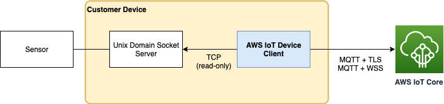

# Sensor Publish

 **Notice:** Running the AWS IoT Device Client will incur usage of AWS IoT services, and is likely to incur charges on your AWS account. Please refer the pricing pages for [AWS IoT Core](https://aws.amazon.com/iot-core/pricing/), [AWS IoT Device Management](https://aws.amazon.com/iot-device-management/pricing/), and [AWS IoT Device Defender](https://aws.amazon.com/iot-device-defender/pricing/) for more details.

[*Back To The Main Readme*](../../README.md)

## Sensor Publish Feature
The AWS IoT Device Client is free, open-source, modular software written in C++ that customers compile and install on Embedded Linux based IoT devices to access AWS IoT Core, AWS IoT Device Management, and AWS IoT Device Defender features. The Sensor Publish feature allows customers to publish sensor data captured on their device to the cloud over MQTT.

### How It Works
The diagram below is a representative deployment of the device client on a customer device with the Sensor Publish feature enabled. The customer runs a local server on the device that serves sensor data over a unix domain socket in streaming mode aka `SOCK_STREAM`. The device client connects to the local server and parses the stream into messages delimited by a customer-provided end-of-message delimiter. Messages are buffered on the device client using the configurable size and time limits described below and published as a single batch to AWS IoT Core over MQTT. Message data received at AWS IoT Core is available for the customer to process using AWS IoT Rules Engine.



### Sensor Publish Configuration
On startup, the device client reads from a configuration file specified using the `--config-file` option. This file is organized into configuration shared by all features aka global configuration and configuration that is specific to each feature.  Examples of global configuration are things such as the IoT device data endpoint, thing name, and x.509 certificate and key. Configuration specific to the Sensor Publish feature is stored in a top level element of the configuration named `sensor-publish`.

An example snippet of configuration for a single sensor setup is shown below. Using this configuration the device client will read sensor data from a local server at address `addr=/tmp/sensors/my-sensor-server`. The device client will parse the sensor data into newline delimited messages using the regular expression `eom_delimiter=[\r\n]+` and publish these messages to a MQTT topic named `mqtt_topic=my-sensor-data`. Since no buffer threshold settings are specified in the configuration (`buffer_time_ms` and `buffer_size` are omitted), the device client will publish complete messages as they are received from the sensor. In addition to sensor data, the device client will also publish a heartbeat message containing the sensor name `name=my-sensor` to a separate MQTT topic named `mqtt_heartbeat_topic=my-sensor-heartbeat`. The heartbeat message is published only when the device client has connectivity to the sensor server. The frequency of the heartbeat message is controlled using the `heartbeat_time_sec` and, if unspecified, will be sent at a default interval of 300 seconds.

```
{
    "endpoint":   "[*].iot.[REGION].amazonaws.com",
    "cert":       "<path-to-x509-certificate>",
    "key":        "<path-to-x509-key>",
    "root-ca":    "<path-to-root-certificate>",
    "thing-name": "[THING-NAME]",
    ...
    "sensor-publish": {
        "sensors": [
            {
                "name": "my-sensor",
                "addr": "/tmp/sensors/my-sensor-server",
                "eom_delimiter": "[\r\n]+",
                "mqtt_topic": "my-sensor-data",
                "mqtt_heartbeat_topic": "my-sensor-heartbeat"
            }
        ]
    }
}
```

A second example configuration for a multiple sensor setup is shown below. In comparison to the previous configuration, this example uses two sensors `sensor-publish.sensors[0].name=my-sensor-01` and `sensor-publish.sensors[1].name=my-sensor-02` with data read from different local servers and published to different MQTT topics. The heartbeat message for both sensors is configured to publish to the same MQTT topic. The configuration and runtime behavior of device client is completely independent for each sensor. A maximum of up to 10 sensors is supported.

```
{
    "endpoint":   "[*].iot.[REGION].amazonaws.com",
    "cert":       "<path-to-x509-certificate>",
    "key":        "<path-to-x509-key>",
    "root-ca":    "<path-to-root-certificate>",
    "thing-name": "[THING-NAME]",
    ...
    "sensor-publish": {
        "sensors": [
            {
                "name": "my-sensor-01",
                "addr": "/tmp/sensors/my-sensor-server-01",
                "eom_delimiter": "[\r\n]+",
                "mqtt_topic": "my-sensor-data-01",
                "mqtt_heartbeat_topic": "my-sensor-heartbeat"
            },
            {
                "name": "my-sensor-02",
                "addr": "/tmp/sensors/my-sensor-server-02",
                "eom_delimiter": "[\r\n]+",
                "mqtt_topic": "my-sensor-data-02",
                "mqtt_heartbeat_topic": "my-sensor-heartbeat"
            }
        ]
    }
}
```

#### Sensor Publish Configuration Details
The comprehensive list of configuration available for this feature appears below.

* `sensors`
    * Array of sensor configuration objects. One object for each sensor connected to the device.
        * Up to 10 sensor entries are supported.
    * An empty array will result in having the feature disabled.
* `name`
    * Human readable name of the sensor. Used to identify the entry in logging and by the heartbeat message (when enabled).
    * This option is not required and if unspecified, the numerical index of the sensor starting from 1 will be used as the name.
* `enabled`
	* A boolean flag to enable or disable the sensor entry.
	* This option is not required and if unspecified, the sensor entry will be enabled.
* `addr`
    * Full path to the unix domain socket on the local filesystem.
        * We do not support names specified using the abstract socket namespace. In other words, the path to the parent directory must exist on the filesystem so that we can enforce the permission checks described below.
    * Connecting to the unix domain socket requires write permission on the socket. This means that both the process used to forward sensor data through the unix domain socket and the device client must have write permission on this file.
        * On startup the device client will verify that the directory in which the file is located is both user and group writable eg `rw-rw----` or octal `660`.
        * Failure to verify will leave the sensor disabled but not block device client from startup.
    * The device client connects to the unix domain socket as a client.
        * We expect that the server process that streams sensor data might occasionally stop, require restart, or generally be unavailable.
        * If a connection to the sensor stream is not available on startup or otherwise lost during normal operations, then the device client will try to reconnect at the polling interval configured by `addr_poll_sec`.
    * This option is required and if unspecified the feature will be disabled for the current sensor, but other entries in the sensor array will continue to be parsed.
* `addr_poll_sec`
    * Interval, in seconds, the device client will use to reconnect to server process that streams sensor data.
        * The device client will never terminate a reconnect loop and the interval is applied without backoff.
    * A value of 0 is interpreted as a busy-poll.
    * This option is not required and if unspecified, the default value will be 10 seconds.
* `buffer_time_ms`
    * Timeout interval, in milliseconds, after which the device client will stop buffering the current batch of messages, if any, and publish to MQTT.
    * The timer is reset each time the timeout expires whether any messages are published during that interval or not.
    * A value of 0 is interpreted as no timeout eg device client will publish a message as soon as data is received from the sensor.
    * This option is not required and if unspecified, the default value will be 0.
* `buffer_size`
    * Number of messages buffered in device client.
    * When the size limit is reached, then the device client will stop buffering the current batch of messages and publish to MQTT.
    * The count of buffered messages is reset whenever messages are published.
    * A value of 0 or 1 is interpreted as no buffering.
    * This option is not required and if unspecified, the default value will be 0.
* `buffer_capacity`
    * Maximum number of bytes buffered for a single message.
    * When the capacity limit is reached, then the device client will stop buffering the current batch of messages and publish to MQTT.
	* Any sensor messages which are larger than the `buffer_capacity` will be logged as an error and discarded. As a result, the buffer capacity should be configured to be large enough to hold at least a few multiples of `buffer_size` messages.
	* This option is not required, must be at least 1024 bytes, and if unspecified, the default value is configured to the AWS IoT message broker message size limit of 128KB.
* `eom_delimiter`
    * End of message (EOM) delimiter used by the device client to parse the text encoded sensor stream.
    * Regular expressions are supported.
        * A multi-character string means that all the characters in the string must appear in the same sequence in order for the device client parser to recognize an end of message.
        * Use a regular expression character class to have one or more the characters treated as end of message.
            * For example, the eom_delimiter used to parse carriage return `\r` or carriage return followed by linefeed `\r\n` would be the character class `[\r\n]+`.
    * Adjacent end of message delimiters without any message data are treated as empty message.
    * This option is required and if unspecified, the feature will be disabled for the current sensor, but other entries in the sensor array will continue to be parsed.
* `mqtt_topic`
    * Name of the MQTT topic to publish data received from this sensor.
    * The topic name does not need to previously exist.
    * This option is required and if unspecified, the feature will be disabled for the current sensor, but other entries in the sensor array will continue to be parsed.
* `mqtt_heartbeat_topic`
    * Name of the MQTT topic to publish a sensor heartbeat message.
    * Heartbeat messages are sent by the device client as long as there is connectivity between the device client and this sensor.
        * The heartbeat message payload is the plaintext sensor `name`.
    * Heartbeat message interval is configured using `heartbeat_time_sec`.
    * This option is not required and if unspecified, then nothing will be published.
* `heartbeat_time_sec`
    * Interval, in seconds, which heartbeat message is published to `mqtt_heartbeat_topic`.
    * This option is not required and if unspecified the default value will be 300 seconds.

### Policy Permissions
In order to use the Sensor Publish feature, the device must have permission to connect to IoT Core eg `iot:Connect`. In addition, the device must have permission to publish messages to the MQTT topic used for sensor data and the sensor heartbeat (when the sensor heartbeat configuration is enabled). The example policy below demonstrates the least privilege permissions required for the Sensor Publish feature. Replace the `<region>` and `<accountId`> with appropriate values for your deployment.

```
{
  "Version": "2012-10-17",
  "Statement": [
    {
      "Effect": "Allow",
      "Action": "iot:Connect",
      "Resource": "arn:aws:iot:<region>:<accountId>:client/${iot:Connection.Thing.ThingName}"
    },
    {
      "Effect": "Allow",
      "Action": "iot:Publish",
      "Resource": "arn:aws:iot:<region>:<accountId>:topic/<sensor-data-topic>"
    },
    {
      "Effect": "Allow",
      "Action": "iot:Publish",
      "Resource": "arn:aws:iot:<region>:<accountId>:topic/<sensor-heartbeat-topic>"
    }
  ]
}
```

### Frequently Asked Questions

#### Q1: How should I set `buffer_size`?
When a user specifies an explicit `buffer_size > 0`, then the device client will only publish batches to satisfy the configured `buffer_size`. In contrast `buffer_size = 0` will publish all available messages as a single batch so that buffer is cleared on every publish.

#### Q2: How should I set `buffer_time_ms`?
When a user specifies an explicit `buffer_time_ms > 0`, then the device client will never wait longer than the configured `buffer_time_ms` before publishing a batch, even when the number of messages in the batch is below the configured `buffer_size`.

#### Q3: How should I set `buffer_capacity`?
The device client reads sensor data into a dynamically allocated buffer of memory with size equal to `buffer_capacity`. The read buffer is allocated once at startup for each sensor entry and managed by the device client using the `buffer_size` and `buffer_time_ms` settings to control how frequently the message data for that sensor are published.  After sensor messages are published, the space in the read buffer previously occupied by these messages is made available for new messages read from the server. If `buffer_capacity` is unset, then the device client will allocate a read buffer with a default size of 128KB.

#### Q4: Under what circumstances will the device client discard sensor data without publishing?
In the event that the read buffer is full, then the device client will publish all buffered messages so that space is made available in the read buffer for new messages. The one exception to this rule is when the read buffer is full and no end of message delimiter(s) have been found. In such cases, rather than publish a partial message, the device client will discard the sensor data without publishing to make space available in the read buffer.

#### Q5: Is there a limit on the size of messages?
Since the AWS IoT message broker message size limit is 128KB, the device client will never publish a message larger than this limit. If your sensor needs to publish messages which are larger than this limit, then you will need to introduce some mechanism for framing the data with a `eom_delimiter` so that it can be parsed by the device client into smaller messages that do not go over this limit.
